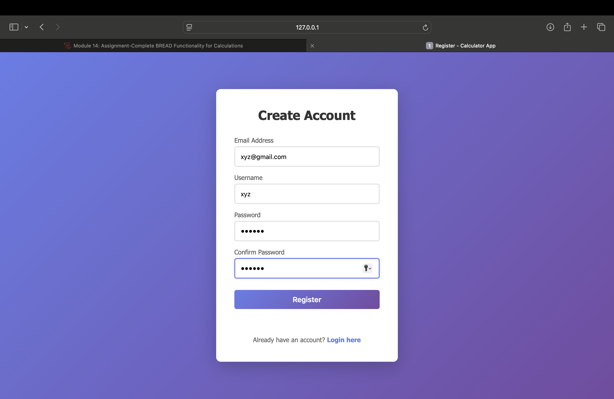
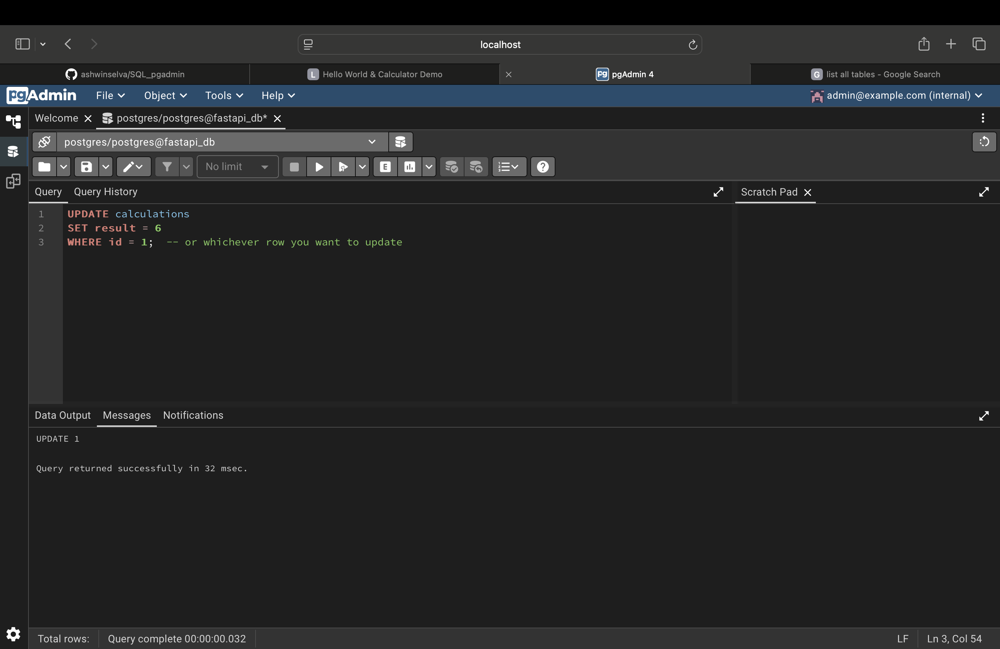
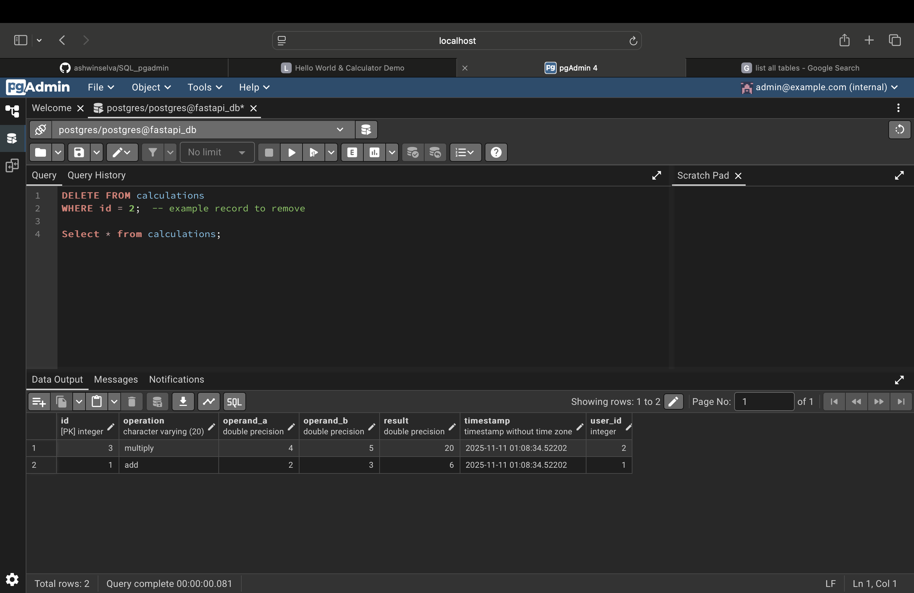
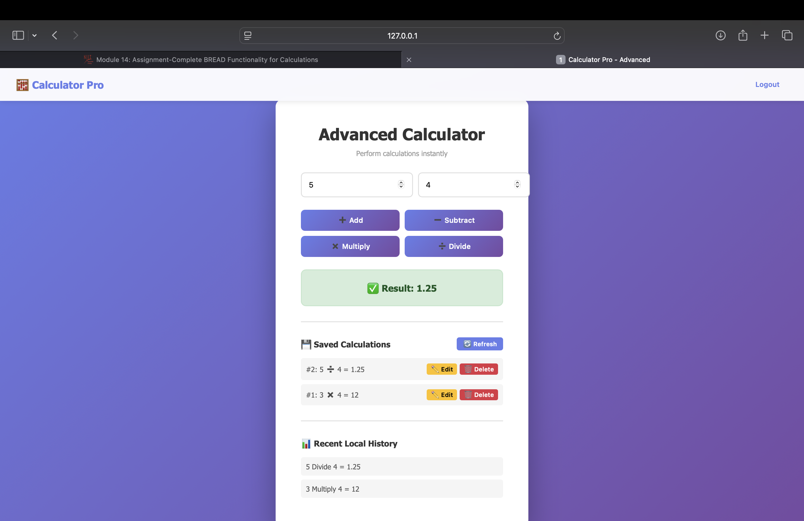

# FastAPI Calculator — Run & Dev Guide

This repository contains a small FastAPI calculator application with unit, integration
and end-to-end tests (Playwright). The project also ships a Docker Compose stack that
includes PostgreSQL and pgAdmin for local development.

This README covers the exact steps to run the project locally, run tests, and
connect pgAdmin to the database.

---

## Requirements

- macOS / Linux / Windows with WSL
- Python 3.11+ (or supplied by the project's venv)
- Docker & Docker Compose (for the docker-compose stack)

---

## Quick local setup (recommended)

1. Create a virtual environment in the project root and activate it:

```bash
cd /path/to/module9_is601
python3 -m venv .venv
source .venv/bin/activate   # macOS / Linux
```

2. Upgrade pip and install dependencies:

```bash
python -m pip install --upgrade pip setuptools wheel
pip install -r requirements.txt
```

3. Install Playwright browsers (required for e2e tests):

```bash
python -m playwright install
```

---

## Run the app (local, non-Docker)

Start the FastAPI app (development mode):

```bash
source .venv/bin/activate
python main.py
```

The app will listen on http://127.0.0.1:8000. Open that in your browser to see the
calculator UI.

---

## Run with Docker Compose (recommended for DB + pgAdmin)

The repository includes `docker-compose.yml` which defines three services: `web` (the
FastAPI app), `db` (Postgres) and `pgadmin` (pgAdmin web UI).

Start the stack:

```bash
cd /path/to/module9_is601
docker compose up -d
```

Check status:

```bash
docker compose ps
docker compose logs -f db
```

If Postgres initializes successfully it will show a `healthy` status. If you hit an
issue related to volume format (Postgres 18+), see Troubleshooting below.

---

## Connect pgAdmin to the database

Open the pgAdmin UI in your browser:

```
http://localhost:5050
```

Login with the defaults from `docker-compose.yml`:

- Email: `admin@example.com`
- Password: `admin`

Add a new Server in pgAdmin (right-click Servers → Create → Server):

- General tab: give it a name, e.g. `fastapi_db`
- Connection tab:
  - Host name/address: `db` ← (when using pgAdmin inside Docker Compose)
  - Port: `5432`
  - Maintenance DB: `postgres` (or `fastapi_db`)
  - Username: `postgres`
  - Password: `postgres`

Notes:

- If you are using pgAdmin desktop (outside Docker), use `localhost` as the host and
  the mapped port (default `5432`).
- If the `db` hostname does not resolve inside pgAdmin, make sure both `pgadmin` and
  `db` containers are running and attached to the same Docker network (Compose does
  this automatically when using the included `docker-compose.yml`).

---

## Run tests

Run unit and integration tests with pytest:

```bash
source .venv/bin/activate
pytest -q
```

To run only non-e2e tests (skip Playwright e2e tests):

```bash
pytest -q -k "not e2e"
```

To run only e2e tests (requires `python -m playwright install` and either local or
Docker app running):

```bash
pytest tests/e2e -q
```

---

## Troubleshooting

- Postgres volume / init errors (Postgres 18+):

  - Recent Postgres images changed where data is stored. The `docker-compose.yml`
    in this repo mounts the named volume at `/var/lib/postgresql` to be compatible
    with newer images. If you see messages about "existing Postgres data in
    /var/lib/postgresql/data (unused mount/volume)" you may have an old volume with
    incompatible format. If you don't need existing data, remove the volume and
    recreate the stack:

  ```bash
  docker compose down -v
  docker volume rm module9_is601_postgres_data
  docker compose up -d
  ```

  - If you must preserve data, you'll need to run an upgrade path (pg_upgrade) or
    start a container with the older Postgres version that created the data, dump
    the DB, then import into a fresh container. I can help with that if needed.

- pgAdmin cannot resolve `db`:
  - Ensure both `pgadmin` and `db` containers are running in the same Compose
    network: `docker compose ps` and `docker network inspect module9_is601_app-network`.

---

## Screenshots (embedded)

Below are screenshots from the `screenshots/` folder with short explanations. If an
image doesn't display in your viewer, make sure the `screenshots/` files are present
in the repository and that your Markdown renderer supports local images.

- `screenshots/a.png` — Homepage showing the app title and the calculator UI with the
  two number inputs and operation buttons. This demonstrates the default page served
  at `/` (used by e2e tests to exercise the UI).

  

- `screenshots/b.png` — pgAdmin server creation dialog prefilled with connection
  information (Host: `db`, Port: `5432`, User: `postgres`). Use this when connecting
  pgAdmin (running inside Docker Compose) to the Postgres service.

  

- `screenshots/c.png` — Example query/results view inside pgAdmin showing the
  `fastapi_db` database and a sample query result. Useful to confirm that the DB
  is reachable and the app has created data as expected.

  

- `screenshots/d.png` — End-to-end test run / coverage output screenshot from the
  CI run (shows test summary and coverage report). Useful to verify the CI
  pipeline and test results.

  

---

## Profile Page (New Feature)

This project includes a **User Profile & Password Change** feature.

- Visit `/profile` after logging in to view and update your username/email.
- Use the **Change Password** form to set a new password; after a successful
  change you'll be redirected to the login page and must sign in with the new
  password.

Automated tests were added for this feature (unit, integration, and E2E). To run
them in your virtual environment use:

```bash
source .venv/bin/activate
pytest -q
```

---

## Useful commands

```bash
# Create venv
python3 -m venv .venv
source .venv/bin/activate

# Install deps + Playwright browsers
pip install -r requirements.txt
python -m playwright install

# Bring docker compose up (DB + pgAdmin)
docker compose up -d

# Check container status and logs
docker compose ps
docker compose logs -f db

# Run tests
pytest -q
```
